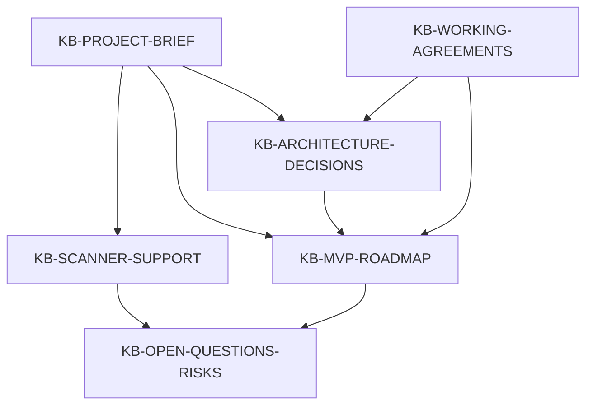

# Knowledge Graph

Dieser Graph beschreibt die zentralen Projektknoten und ihre Beziehungen. Die Dateien bleiben bewusst Markdown-basiert, damit die Wissensbasis ohne zusaetzliche Infrastruktur versionierbar und leicht editierbar bleibt.

## Knoten

| ID | Datei | Zweck |
|---|---|---|
| `KB-PROJECT-BRIEF` | [project-brief.md](project-brief.md) | Zielbild, Scope und MVP-Grenzen |
| `KB-ARCHITECTURE-DECISIONS` | [architecture-decisions.md](architecture-decisions.md) | Persistierte Architekturentscheidungen |
| `KB-MVP-ROADMAP` | [mvp-roadmap.md](mvp-roadmap.md) | Phasen und Reihenfolge der Umsetzung |
| `KB-SCANNER-SUPPORT` | [scanner-support-strategy.md](scanner-support-strategy.md) | Strategie fuer Scanner- und Hersteller-Support |
| `KB-WORKING-AGREEMENTS` | [working-agreements.md](working-agreements.md) | Arbeitsweise, Dokumentationsregeln und technische Leitplanken |
| `KB-OPEN-QUESTIONS-RISKS` | [open-questions-and-risks.md](open-questions-and-risks.md) | Offene Fragen, Risiken und Annahmen |

## Beziehungen

## Graph-Konventionen

- Entscheidungen werden als `ADR-000` gefuehrt.
- Offene Fragen werden als `Q-000` gefuehrt.
- Risiken werden als `R-000` gefuehrt.
- Annahmen werden als `A-000` gefuehrt.
- Ein Knoten darf auf mehrere andere Knoten verweisen, aber soll jeweils einen klaren Hauptzweck behalten.
